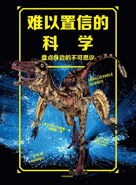



Book
=====

* [你的第一本英文学术写作指导书](https://www.zhihu.com/pub/book/119555946)

Book Translation
=====

* [生命是什么](https://book.douban.com/subject/34853190/)

This is my translation of the renowned book "What is Life?" by Erwin Schrödinger. Despite the numerous translations yet available on the market, my added hundreds of new footnotes to help explaining the deep concept of Schrödinger, as well as the most recent research progresses on some of the aspects that Schrödinger mentioned in his book.

* [难以置信的科学](https://book.douban.com/subject/34809806/)

 

A translation of "[Unbelievable Science](https://www.goodreads.com/book/show/37936815-unbelievable-science)" by Colin Barras.

Fun Projects
=====

* [yys optmizer](https://github.com/luyaozou/yys_mf_optimizer)

A simple Python GUI script solver for completing the task in a popular mobile game "Onmyoji".
The solver uses a integer linear programming module [pulp](https://www.coin-or.org/PuLP/pulp.html). 
The explanation of the algorithm is [here](https://zhuanlan.zhihu.com/p/50580339).
